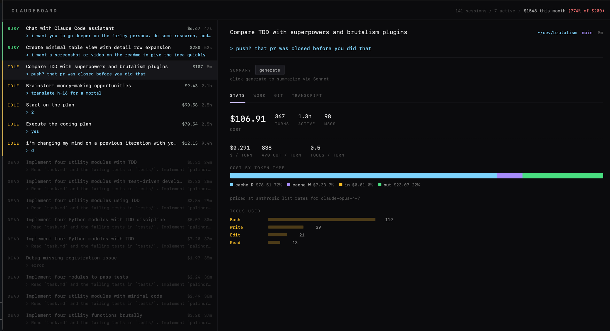

# claudeboard

A live web dashboard for [Claude Code](https://claude.com/claude-code) sessions. Watches `~/.claude/projects/` and tells you what every terminal tab is doing, what each session has cost, and how your month-to-date burn compares to the $200 Max plan.




## Run

```bash
uv sync
uv run claudeboard
```

Open <http://localhost:8765>.

For one-click Sonnet session summaries, set `ANTHROPIC_API_KEY` in the environment.

## What it shows

- Sidebar of every session with `busy` / `idle` / `dead` status, derived from `ps`+`lsof` (which `claude` processes are pointing at which cwd) with mtime fallback.
- Per-session cost at real Anthropic list prices for the actual model used. Header shows month-to-date vs the $200 Max plan.
- Per-session detail: token + cost mix (in / out / cache\_r / cache\_w), git diff and commits since session start, files edited/written/read with op counts, filtered transcript.

## Pricing notes

The four token types in one paragraph: every Claude Code turn re-sends the whole conversation + system prompt + tool definitions, so volume is dominated by **cache reads** at $1.50 / MTok (Opus). The bill is dominated by **output** at $75 / MTok (50× the cache-read rate, even though output is < 1% of volume) and **cache writes** at $18.75 / MTok (the 25%-premium-on-input cost of *creating* the cache so reads can be cheap).

`sessions.py` carries the `PRICING` table; unknown models fall back to Sonnet rates. Update when Anthropic changes prices.

## Develop

```bash
uv sync --extra dev
uv run pre-commit install
uv run pytest
uv run ruff check
uv run ruff format
```

Runtime is stdlib only — no third-party Python deps. CI runs ruff + pytest on Python 3.10 / 3.11 / 3.12.
